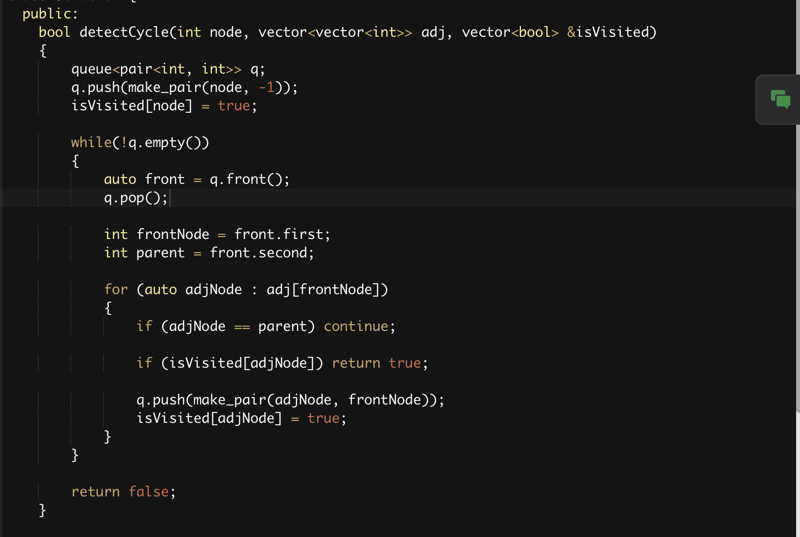
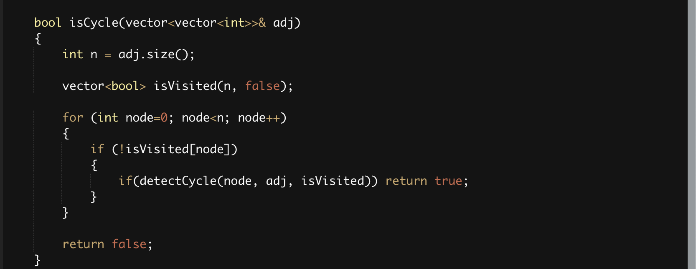
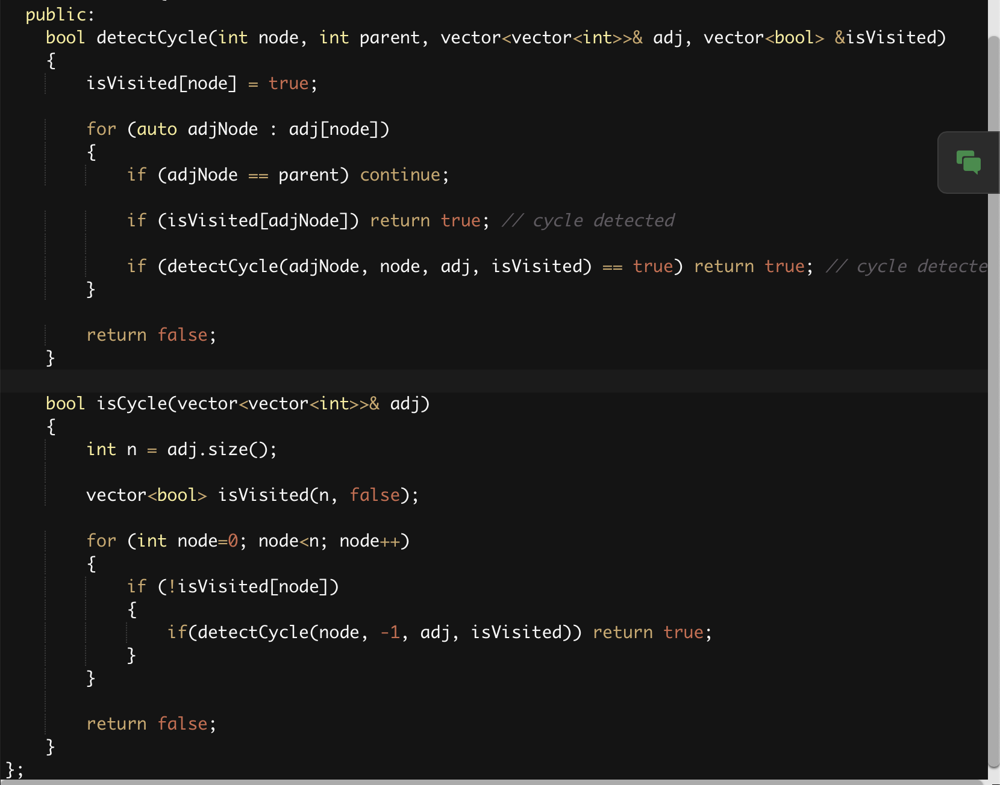
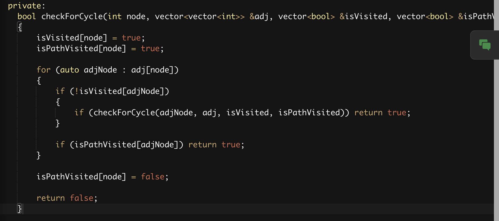
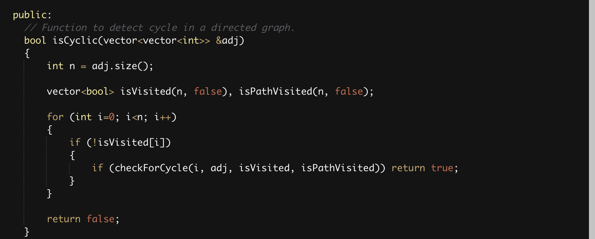
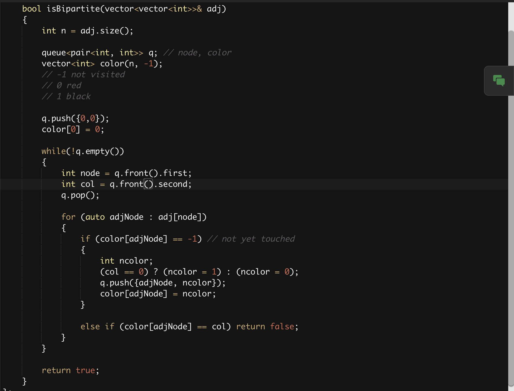
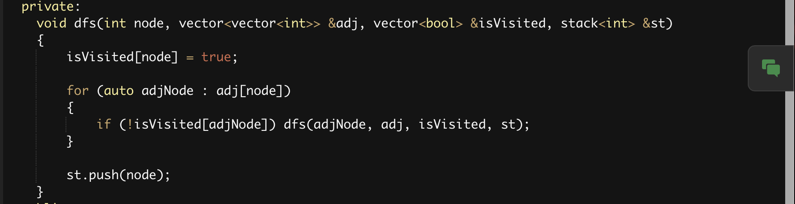
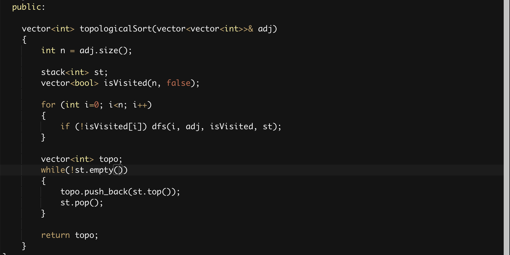

# Basic Terms
1. Types of graphs
    - Undirected graphs
    - Directed graphs

2. Cycles in a graph
    - Cyclic graph
    - Acyclic graph

3. Path

4. Degree of a node: Number of edges attached to a node
    - In Degree of a node: Number of incoming edges to a node
    - Out Degree of  node: Number of outgoing edges to a node
    - Total Degree = 2 x Number of edges

5. Edges
    - Directed Graph
    - Undirected Graph

6. Edge Weights

7. Graph Representation
    - Adjacency Matrix: Time: Nodes, Space: NodesxEdges
    - Adjacency List: Time: Nodes, Space: 2xEdges

8. Connected Components
    - Always use a visited bool array to make sure you reach each component of a graph using any traversal technique
    - Any traversal algorithms traverses only the connected component of the graph


# Traversals

## BFS Traversal (Level Order Traversal)
    - Time: Nodes (N) + Degree (2xEdges for undirected, Edges for directed)
    - Space: Nodes (N)
    - Initial Configuration: Queue data structure having the starting node, isVisited array with starting node visited
    - Algorithm: Start taking out from the front of queue and print/store, and then add its neighbour. Repeat until the queue is empty.

## DFS Traversal
    - Time: Nodes (N) + Degree (2xEdges for undirected, Edges for directed)
    - Space: Nodes (N), Recursion Space Stack: Node (N)
    - Initial Configuration: isVisited array
    - Algorithm: Use recusrion, mark the node as visited on entering the function and print/store it. Call the recusrion on its neighbours if they are unvisited

# Questions On Traversals
## Number of Provinces
https://www.geeksforgeeks.org/problems/number-of-provinces/1?utm_source=youtube&utm_medium=collab_striver_ytdescription&utm_campaign=number_of_provinces
```cpp
class Solution 
{
  private:
    void dfsTraversal(int node, vector<vector<int>> &adj, vector<bool> &isVisited)
    {
        isVisited[node] = true;
        
        for (int adjNode = 0; adjNode < adj[node].size(); adjNode++)
        {
            if (adjNode != node && adj[node][adjNode] == 1)
            {
                if (!isVisited[adjNode]) dfsTraversal(adjNode, adj, isVisited);
            }
        }
    }
    
  public:
    int numProvinces(vector<vector<int>> adj, int V) 
    {
        int numProvinces = 0;
        
        vector<bool> isVisited(V, false);
        
        for (int node=0; node<V; node++)
        {
            if (!isVisited[node])
            {
                numProvinces++;
                dfsTraversal(node, adj, isVisited);
            }
        }
        
        return numProvinces;
    }
};
```


## Number of Islands in Matrix
https://www.geeksforgeeks.org/problems/find-the-number-of-islands/1?utm_source=youtube&utm_medium=collab_striver_ytdescription&utm_campaign=find_the_number_of_islands
```cpp
class Solution 
{
  private:
  
    bool isValid(int row, int col, int maxRow, int maxCol)
    {
        return (row >=0 && row < maxRow && col >= 0 && col < maxCol);
    }
    
    void dfs(int row, int col, vector<vector<char>> &grid, vector<vector<bool>> &isVisited)
    {
        isVisited[row][col] = true;
        
        int delrow[] = {-1,-1,0,1,1,1,0,-1};
        int delcol[] = {0,1,1,1,0,-1,-1,-1};
        
        for (int i=0; i<8; i++)
        {
            int nrow = row + delrow[i];
            int ncol = col + delcol[i];
            
            if (isValid(nrow, ncol, grid.size(), grid[0].size()))
            {
                if (grid[nrow][ncol] == '1' && !isVisited[nrow][ncol])
                {
                    dfs(nrow, ncol, grid, isVisited);
                }
            }
        }
    }
    
  public:
    // Function to find the number of islands.
    int numIslands(vector<vector<char>>& grid) 
    {
        int m = grid.size();
        int n = grid[0].size();
        
        vector<vector<bool>> isVisited(m, vector<bool>(n, false));
        
        int numOfIslands = 0;
        
        for (int i=0; i<m; i++)
        {
            for (int j=0; j<n; j++)
            {
                if (grid[i][j] == '1' && !isVisited[i][j])
                {
                    numOfIslands++;
                    dfs(i, j, grid, isVisited);
                }
            }
        }
        
        return numOfIslands;
    }
};
```

## Flood Fill Algorithm
https://www.geeksforgeeks.org/problems/flood-fill-algorithm1856/1?utm_source=youtube&utm_medium=collab_striver_ytdescription&utm_campaign=flood-fill-algorithm
```cpp
class Solution 
{
  private:
    bool isValid(int row, int col, int maxRow, int maxCol)
    {
        return (row >= 0 && row < maxRow && col >= 0 && col < maxCol);
    }
    
  public:
    vector<vector<int>> floodFill(vector<vector<int>>& image, int sr, int sc, int newColor) 
    {
        vector<vector<int>> ans = image;
        
        int n = ans.size();
        int m = ans[0].size();
        
        vector<vector<bool>> isVisited(n, vector<bool>(m, false));
        queue<pair<int, int>> q;
        int startColor = ans[sr][sc];
        
        q.push(make_pair(sr, sc));
        
        while(!q.empty())
        {
            pair<int, int> p = q.front();
            q.pop();
            int row = p.first;
            int col = p.second;
            isVisited[row][col] = true;
            ans[row][col] = newColor;
            
            int delrow[] = {-1,0,1,0};
            int delcol[] = {0,1,0,-1};
            
            for (int i=0; i<4; i++)
            {
                int nrow = row + delrow[i];
                int ncol = col + delcol[i];
                
                if (isValid(nrow, ncol, n, m))
                {
                    if (ans[nrow][ncol] == startColor && !isVisited[nrow][ncol])
                    {
                        q.push(make_pair(nrow, ncol));
                    }
                }
            }
        }
        
        return ans;
    }
};
```

## Rotten Oranges: Minimum Time to Rot All Oranges
https://www.geeksforgeeks.org/problems/rotten-oranges2536/1?utm_source=youtube&utm_medium=collab_striver_ytdescription&utm_campaign=rotten_oranges
```cpp
class Solution {
  private:
    bool isValid(int row, int col, int maxRow, int maxCol)
    {
        return (row >= 0 && row < maxRow && col >= 0 && col < maxCol);
    }
    
    bool allOrangesRotten(int orangesRotten, int initialFreshOranges)
    {
        return (orangesRotten == initialFreshOranges);
    }
    
  public:

    int orangesRotting(vector<vector<int>>& mat) 
    {
        int n = mat.size();
        int m = mat[0].size();
        int initialFreshOranges = 0;
        
        // 0 means no oranage
        // 1 means fresh
        // 2 means rotten
        vector<vector<int>> isVisited(n, vector<int>(m, 0)); 
        
        queue<pair<pair<int, int>, int>> q;
        
        // put all the oranges which are initially rotten
        for (int i=0; i<n; i++)
        {
            for (int j=0; j<m; j++)
            {
                if (mat[i][j] == 1) initialFreshOranges++;
                
                if (mat[i][j] == 2)
                {
                    q.push(make_pair(make_pair(i, j), 0));
                    isVisited[i][j] = 2;
                }
            }
        }
        
        int ans = 0;
        int orangesGettingRotten = 0;
        // start processing until the queue is empty
        while(!q.empty())
        {
            auto front = q.front();
            q.pop();
            
            int row = front.first.first;
            int col = front.first.second;
            int time = front.second;
            
            ans = max(ans, time);
            
            int delrow[] = {-1,1,0,0};
            int delcol[] = {0,0,-1,1};
            
            for (int i=0; i<4; i++)
            {
                int nrow = row + delrow[i];
                int ncol = col + delcol[i];
                
                if (isValid(nrow, ncol, n, m))
                {
                    if (mat[nrow][ncol] == 1 && isVisited[nrow][ncol] != 2)
                    {
                        q.push(make_pair(make_pair(nrow, ncol), time+1));
                        isVisited[nrow][ncol] = 2;
                        orangesGettingRotten++;
                    }
                }
            }
        }
        
        if (allOrangesRotten(orangesGettingRotten, initialFreshOranges)) return ans;
        else return -1;
    }
};
```


## Distance of Neareset Cell Having 1
https://www.geeksforgeeks.org/problems/distance-of-nearest-cell-having-1-1587115620/1?utm_source=youtube&utm_medium=collab_striver_ytdescription&utm_campaign=distance-of-nearest-cell-having-1
```cpp
class Solution 
{
  private:
    bool isValid(int row, int col, int maxRow, int maxCol)
    {
        return (row >= 0 && row < maxRow && col >= 0 && col < maxCol);
    }
    
  public:
    vector<vector<int>> nearest(vector<vector<int>>& grid) 
    {
        int n = grid.size();
        int m = grid[0].size();
        
        // take a queue and put all the 1s in it with distance as 0
        vector<vector<int>> dst(n, vector<int>(m, INT_MAX)); // INTMAX means the cell has not been reached
        
        queue<pair<pair<int, int>, int>> q;
        
        for (int i=0; i<n; i++)
        {
            for (int j=0; j<m; j++)
            {
                if (grid[i][j] == 1)
                {
                    q.push({{i, j}, 0});
                    dst[i][j] = 0;
                }
            }
        }
        
        while(!q.empty())
        {
            int row = q.front().first.first;
            int col = q.front().first.second;
            int distance = q.front().second;
            q.pop();
            
            // start iterating on its neighbours
            int delrow[] = {-1,1,0,0};
            int delcol[] = {0,0,-1,1};
            
            for (int i=0; i<4; i++)
            {
                int nrow = row + delrow[i];
                int ncol = col + delcol[i];
                
                if (isValid(nrow, ncol, n, m) && dst[nrow][ncol] == INT_MAX)
                {
                    q.push({{nrow, ncol}, distance+1});
                    dst[nrow][ncol] = distance+1;
                }
            }
        }
        
        return dst;
    }
};
```


## Surrounded Regions: Replace Os with Xs
https://www.geeksforgeeks.org/problems/replace-os-with-xs0052/1?utm_source=youtube&utm_medium=collab_striver_ytdescription&utm_campaign=replace-os-with-xs
- Figure out the Os on the boundary and any other Os connected with it
- Replace all other 0s except those found out
```cpp
class Solution 
{
  public:
    vector<vector<char>> fill(vector<vector<char>>& mat) 
    {
        int n = mat.size();
        int m = mat[0].size();
        
        // mark Os on the boundary
        // -1 not visited
        // 0 not on boundary or connected to it
        // 1 on boundary or connected to it
        vector<vector<int>> onBoundary(n, vector<int>(m, -1));
        
        queue<pair<int, int>> q;
        
        for (int i=0; i<n; i++)
        {
            if (mat[i][0] == 'O')
            {
                onBoundary[i][0] = 1;
                q.push({i,0});
            }
            else onBoundary[i][0] = 0;
            if (mat[i][m-1] == 'O')
            {
                onBoundary[i][m-1] = 1;
                q.push({i,m-1});
            }
            else onBoundary[i][m-1] = 0;
        }
        
        for (int j=0; j<m; j++)
        {
            if (mat[0][j] == 'O')
            {
                onBoundary[0][j] = 1;
                q.push({0,j});
            }
            else onBoundary[0][j] = 0;
            if (mat[n-1][j] == 'O') 
            {
                onBoundary[n-1][j] = 1;
                q.push({n-1,j});
            }
            else onBoundary[n-1][j] = 0;
        }
        
        while(!q.empty())
        {
            int row = q.front().first;
            int col = q.front().second;
            q.pop();
            
            int delrow[] = {1,-1,0,0};
            int delcol[] = {0,0,-1,1};
            
            for (int i=0; i<4; i++)
            {
                int nrow = row + delrow[i];
                int ncol = col + delcol[i];
                
                // if valid and unvisited
                if (nrow >= 0 && nrow < n && ncol >= 0 && ncol < m && onBoundary[nrow][ncol] == -1)
                {
                    if (mat[nrow][ncol] == 'O')
                    {
                        q.push({nrow, ncol});
                        onBoundary[nrow][ncol] = 1;
                    }
                    else onBoundary[nrow][ncol] = 0;
                }
            }
        }
        
        // All Os not connected with boundary are converted to X
        // All Os on the bouundary remain 0s
        vector<vector<char>> ans(n, vector<char>(m, 'X'));
        for (int i=0; i<n; i++)
        {
            for (int j=0; j<m; j++)
            {
                if (mat[i][j] == 'O' && onBoundary[i][j] == 1) ans[i][j] = 'O';
            }
        }
        
        return ans;
    }
};
```


## Number of Enclaves: Multisource BFS
https://www.geeksforgeeks.org/problems/number-of-enclaves/1?utm_source=youtube&utm_medium=collab_striver_ytdescription&utm_campaign=number-of-enclaves
```cpp
class Solution 
{
  private:
    bool isValid(int row, int col, int maxRow, int maxCol)
  {
      return (row >= 0 && col >= 0 && row < maxRow && col < maxCol);
  }
  
  public:
    int numberOfEnclaves(vector<vector<int>> &grid) 
    {
        int n = grid.size();
        int m = grid[0].size();
        
        // any land cell on the boundary can lead to a jump off the grid
        // which means any land cell 4 directionally connected to it can also lead to a jump
        
        vector<vector<int>> landCellOnBoundary(n, vector<int>(m, -1));
        // -1 means not visited
        // 0 means not connected with boundary
        // 1 means connected with boundary
        
        queue<pair<int, int>> q;
        
        for (int i=0; i<n; i++)
        {
            // left col
            if (grid[i][0] == 1)
            {
                q.push({i, 0});
                landCellOnBoundary[i][0] = 1;
            }
            else landCellOnBoundary[i][0] = 0;
            
            // right col
            if (grid[i][m-1] == 1)
            {
                q.push({i, m-1});
                landCellOnBoundary[i][m-1] = 1;
            }
            else landCellOnBoundary[i][m-1] = 0;
        }
        
        for (int j=0; j<m; j++)
        {
            // top row
            if (grid[0][j] == 1)
            {
                q.push({0, j});
                landCellOnBoundary[0][j] = 1;
            }
            else landCellOnBoundary[0][j] = 0;
            
            // bottom row
            if (grid[n-1][j] == 1)
            {
                q.push({n-1, j});
                landCellOnBoundary[n-1][j] = 1;
            }
            else landCellOnBoundary[n-1][j] = 0;
        }
        
        while(!q.empty())
        {
            int row = q.front().first;
            int col = q.front().second;
            q.pop();
            
            // iterate on neighbours
            int dr[] = {-1,1,0,0};
            int dc[] = {0,0,1,-1};
            
            for (int i=0; i<4; i++)
            {
                int nrow = row + dr[i];
                int ncol = col + dc[i];
                
                // if valid and unvisited
                if (isValid(nrow, ncol, n, m) && landCellOnBoundary[nrow][ncol] == -1)
                {
                    if (grid[nrow][ncol] == 1)
                    {
                        q.push({nrow, ncol});
                        landCellOnBoundary[nrow][ncol] = 1;
                    }
                    
                    else landCellOnBoundary[nrow][ncol] = 0;
                }
            }
        }
        
        int ans = 0;
        for (int i=0; i<n; i++)
        {
            for (int j=0; j<m; j++)
            {
                if (grid[i][j] == 1 && landCellOnBoundary[i][j] != 1) ans++;
            }
        }
        
        return ans;
    }
};
```


## Number of Distinct Islands
https://www.geeksforgeeks.org/problems/number-of-distinct-islands/1?utm_source=youtube&utm_medium=collab_striver_ytdescription&utm_campaign=number-of-distinct-islands
- Use base row and base col to distinguish identity of islands
- Subtrcat all cells from the coordinats of base cell
- Require a set to keep track of distinct elements
```cpp
class Solution 
{
  private:
    bool isValid(int row, int col, int maxRow, int maxCol)
    {
        return (row >= 0 && col >= 0 && row < maxRow && col < maxCol);
    }
    
    void dfs(int row, int col, vector<vector<int>>& grid, vector<vector<bool>> &isVisited, vector<pair<int, int>> &coordinates, int baseRow, int baseCol)
    {
        isVisited[row][col] = true;
        coordinates.push_back({row-baseRow, col-baseCol});
        
        // iterate on neighbours
        int dr[] = {1,-1,0,0};
        int dc[] = {0,0,1,-1};
        
        for (int i=0; i<4; i++)
        {
            int nrow = row + dr[i];
            int ncol = col + dc[i];
            
            // if valid and unvisited
            if (isValid(nrow, ncol, grid.size(), grid[0].size()) && !isVisited[nrow][ncol])
            {
                if (grid[nrow][ncol] == 1)
                {
                    dfs(nrow, ncol, grid, isVisited, coordinates, baseRow, baseCol);
                }
            }
        }
        
    }
    
  public:
    int countDistinctIslands(vector<vector<int>>& grid) 
    {
        int n = grid.size();
        int m = grid[0].size();
        
        vector<vector<bool>> isVisited(n, vector<bool>(m, false));
        set<vector<pair<int, int>>> set;
        
        for (int i=0; i<n; i++)
        {
            for (int j=0; j<m; j++)
            {
                if (!isVisited[i][j] && grid[i][j] == 1)
                {
                    vector<pair<int, int>> coordinates;
                    dfs(i, j, grid, isVisited, coordinates, i, j);
                    set.insert(coordinates);
                }
            }
        }
        
        int ans = set.size();
        
        return ans;
    }
};
```


# Cycle Detection
- Try to visit all the children (neighbours) of a node which are not parents
- If such a node is already visited by someone else
- It means there is a cycle

## Undirected Graph Using BFS

https://www.geeksforgeeks.org/problems/detect-cycle-in-an-undirected-graph/1?itm_source=geeksforgeeks&itm_medium=article&itm_campaign=practice_card




## Undirected Graph Using DFS
https://www.geeksforgeeks.org/problems/detect-cycle-in-an-undirected-graph/1?itm_source=geeksforgeeks&itm_medium=article&itm_campaign=practice_card


## Directed Graph Using DFS
- Use a path visited array
https://www.geeksforgeeks.org/problems/detect-cycle-in-a-directed-graph/1?utm_source=youtube&utm_medium=collab_striver_ytdescription&utm_campaign=detect-cycle-in-a-directed-graph



# Bipartite Graphs
- If you can color the graph with two colors such that no two adjacent nodes have the same color
- Then it is a bipartite graph
- A bipartite graph is a type of graph in which the set of vertices can be divided into two distinct groups (or partitions) such that no two vertices within the same group are adjacent.
- In other words, all edges in the graph connect a vertex from one group to a vertex in the other group.
- A bipartite graph can be colored with two colors such that no two adjacent vertices share the same color. This means we can divide the graph’s vertices into two distinct sets where:
- All edges connect vertices from one set to vertices in the other set.
- No edges exist between vertices within the same set.

## Properties of Bipartite Graphs:
- No Odd-Length Cycles: A graph is bipartite if and only if it does not contain a cycle of odd length.
- 2-Colorability: A bipartite graph can be colored using only two colors so that no two adjacent vertices have the same color.
- Matching and Maximum Matching: Bipartite graphs are useful in optimization problems, such as maximum matching in job assignment problems.

## Checking for Bipartite Graph Using BFS
https://www.geeksforgeeks.org/problems/bipartite-graph/1?utm_source=youtube&utm_medium=collab_striver_ytdescription&utm_campaign=bipartite-graph


## Checking for Bipartite Graph Using DFS
https://www.geeksforgeeks.org/problems/bipartite-graph/1?utm_source=youtube&utm_medium=collab_striver_ytdescription&utm_campaign=bipartite-graph


# Topological Sorting
- Only exists for DAG (Directed Acyclic Graphs)
- Any linear ordering of nodes such that
- If there is an edge between u and v
- u always appers before v in the sorted list
https://www.geeksforgeeks.org/problems/topological-sort/1?utm_source=youtube&utm_medium=collab_striver_ytdescription&utm_campaign=topological-sort



## Lec 20


## Lec 21


## Lec 22


## Lec 23


## Lec 24


## Lec 25


## Lec 26


## Lec 27


## Lec 28


## Lec 29


## Lec 30


## Lec 31


## Lec 32


## Lec 33


## Lec 34


## Lec 35


## Lec 36


## Lec 37


## Lec 38


## Lec 39


## Lec 40


## Lec 41


## Lec 42


## Lec 43


## Lec 44


## Lec 45


## Lec 46


## Lec 47


## Lec 48


## Lec 49


## Lec 50


## Lec 51


## Lec 52


## Lec 53


## Lec 54


## Lec 55


## Lec 56
