# Basic Terms
1. Types of graphs
    - Undirected graphs
    - Directed graphs

2. Cycles in a graph
    - Cyclic graph
    - Acyclic graph

3. Path

4. Degree of a node: Number of edges attached to a node
    - In Degree of a node: Number of incoming edges to a node
    - Out Degree of  node: Number of outgoing edges to a node
    - Total Degree = 2 x Number of edges

5. Edges
    - Directed Graph
    - Undirected Graph

6. Edge Weights

7. Graph Representation
    - Adjacency Matrix: Time: Nodes, Space: NodesxEdges
    - Adjacency List: Time: Nodes, Space: 2xEdges

8. Connected Components
    - Always use a visited bool array to make sure you reach each component of a graph using any traversal technique
    - Any traversal algorithms traverses only the connected component of the graph

# Traversals

## BFS Traversal (Level Order Traversal)
    - Time: Nodes (N) + Degree (2xEdges for undirected, Edges for directed)
    - Space: Nodes (N)
    - Initial Configuration: Queue data structure having the starting node, isVisited array with starting node visited
    - Algorithm: Start taking out from the front of queue and print/store, and then add its neighbour. Repeat until the queue is empty.

## DFS Traversal
    - Time: Nodes (N) + Degree (2xEdges for undirected, Edges for directed)
    - Space: Nodes (N), Recursion Space Stack: Node (N)
    - Initial Configuration: isVisited array
    - Algorithm: Use recusrion, mark the node as visited on entering the function and print/store it. Call the recusrion on its neighbours if they are unvisited

# Questions On Traversals
## Number of Provinces
https://www.geeksforgeeks.org/problems/number-of-provinces/1?utm_source=youtube&utm_medium=collab_striver_ytdescription&utm_campaign=number_of_provinces
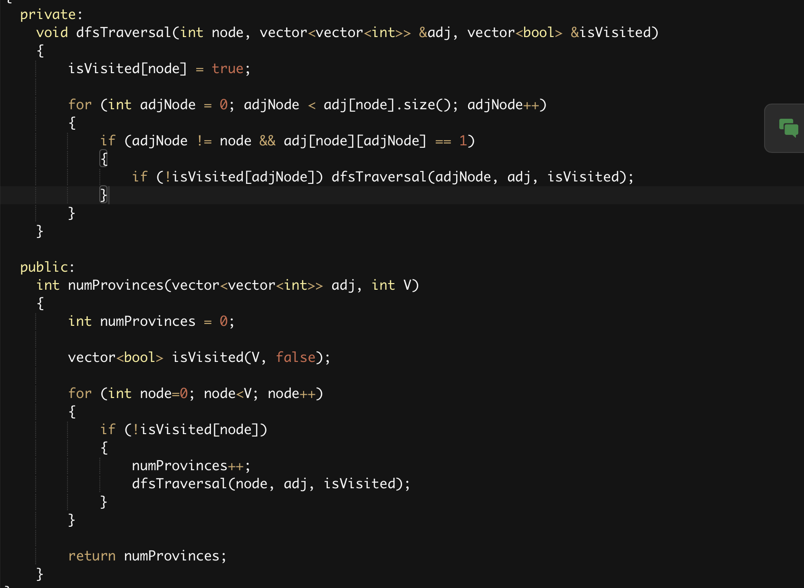

## Number of Islands in Matrix
https://www.geeksforgeeks.org/problems/find-the-number-of-islands/1?utm_source=youtube&utm_medium=collab_striver_ytdescription&utm_campaign=find_the_number_of_islands
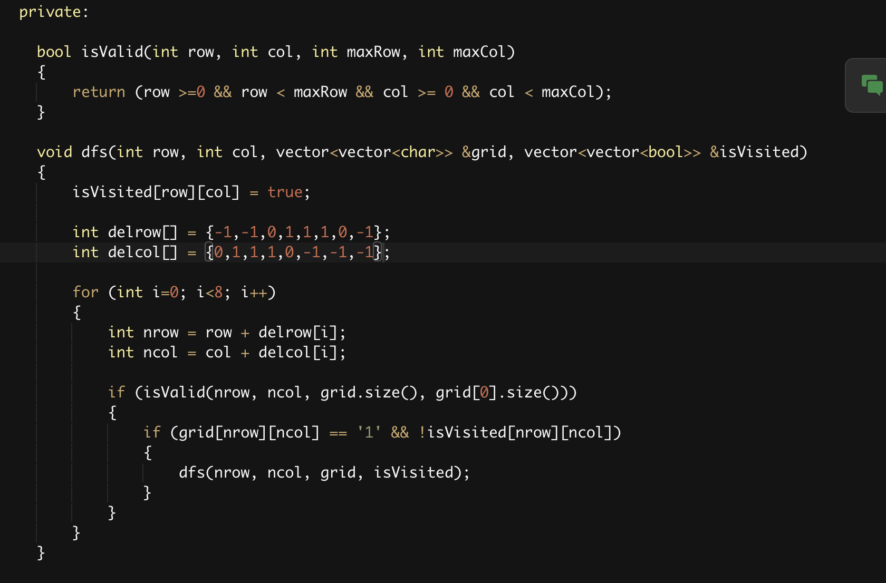
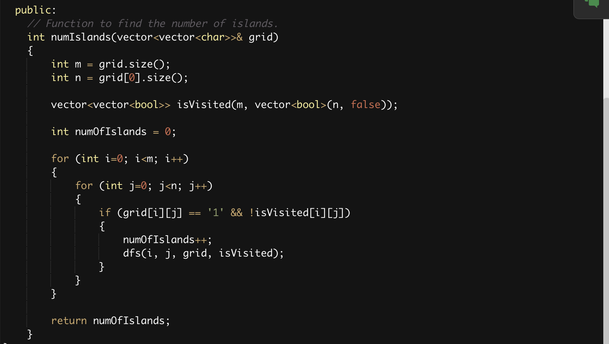

## Flood Fill Algorithm
https://www.geeksforgeeks.org/problems/flood-fill-algorithm1856/1?utm_source=youtube&utm_medium=collab_striver_ytdescription&utm_campaign=flood-fill-algorithm

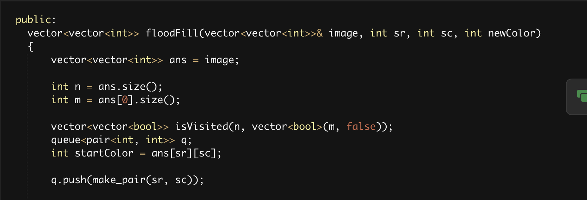
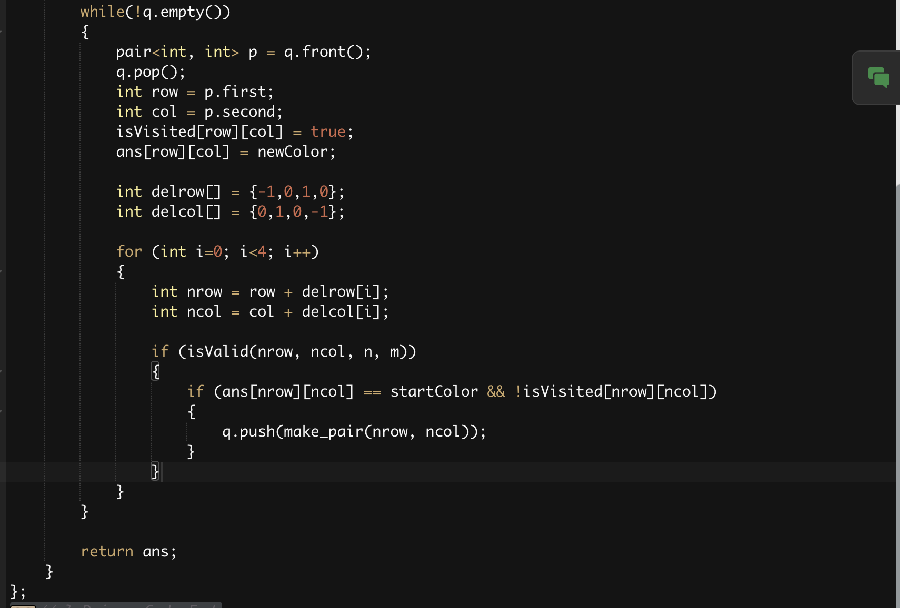

## Rotten Oranges: Minimum Time to Rot All Oranges
https://www.geeksforgeeks.org/problems/rotten-oranges2536/1?utm_source=youtube&utm_medium=collab_striver_ytdescription&utm_campaign=rotten_oranges
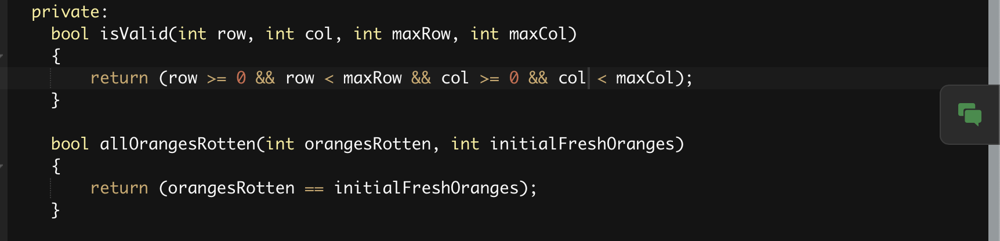
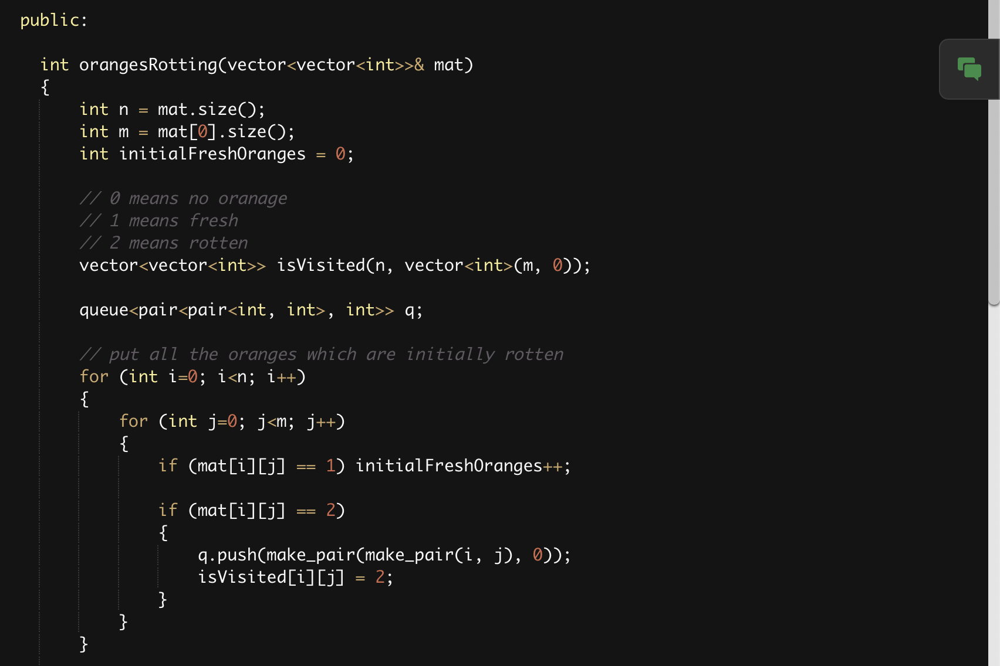
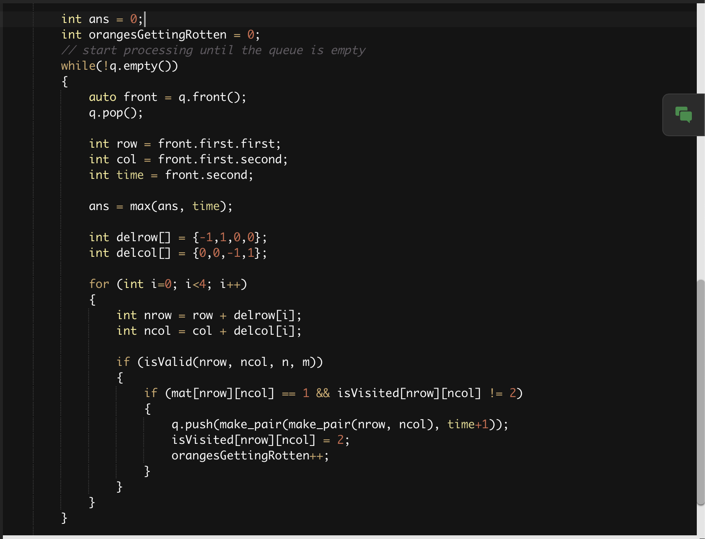

## Distance of Neareset Cell Having 1
https://www.geeksforgeeks.org/problems/distance-of-nearest-cell-having-1-1587115620/1?utm_source=youtube&utm_medium=collab_striver_ytdescription&utm_campaign=distance-of-nearest-cell-having-1

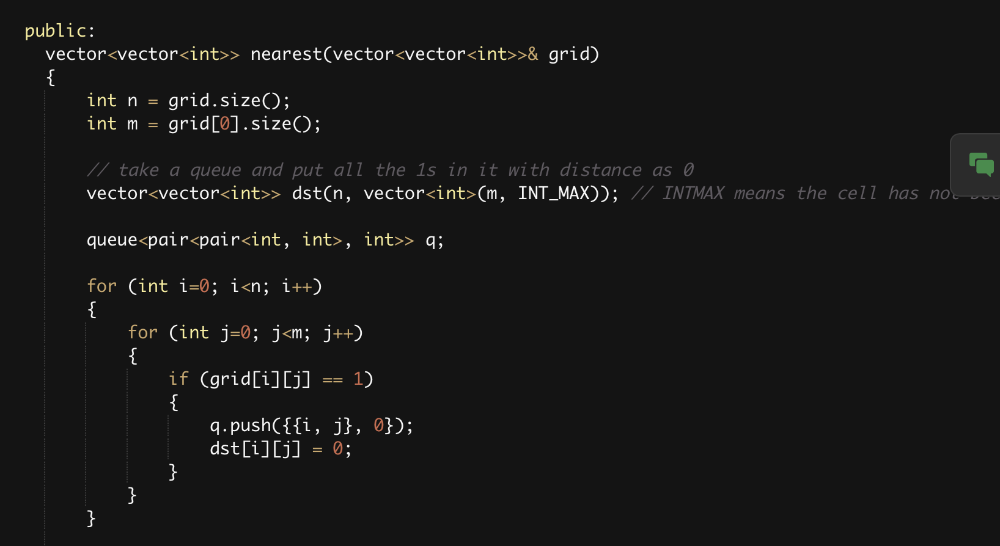
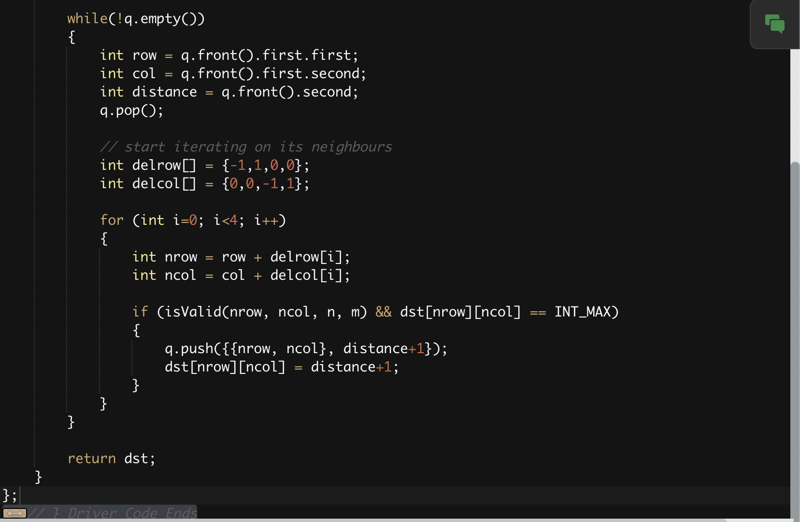

## Surrounded Regions: Replace Os with Xs
https://www.geeksforgeeks.org/problems/replace-os-with-xs0052/1?utm_source=youtube&utm_medium=collab_striver_ytdescription&utm_campaign=replace-os-with-xs
- Figure out the Os on the boundary and any other Os connected with it
- Replace all other 0s except those found out
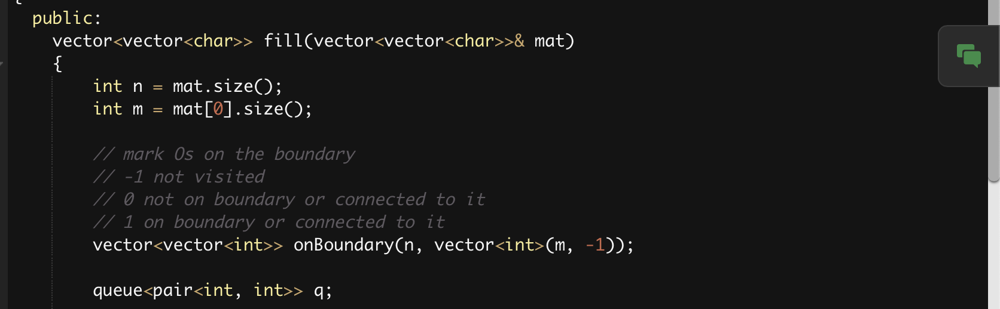
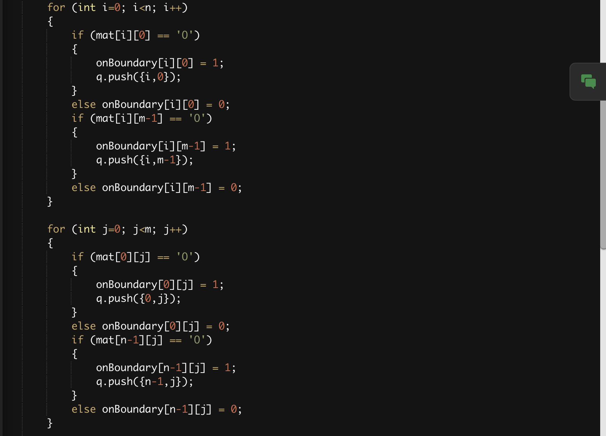
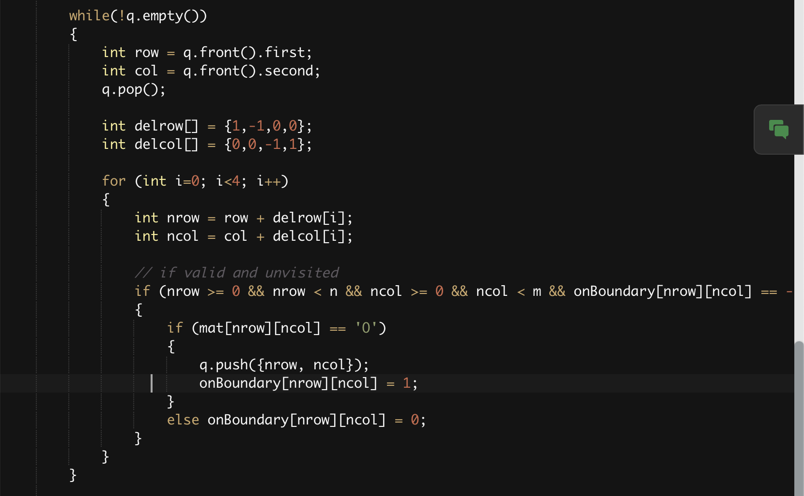
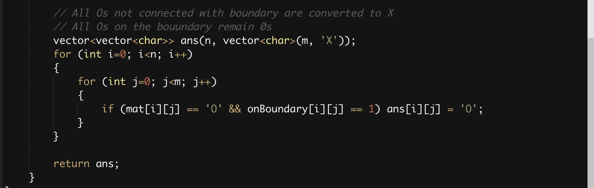

## Number of Enclaves: Multisource BFS

## Number of Distinct Islands

# Cycle Detection
## Undirected Graph Using BFS
- Try to visit all the children (neighbours) of a node which are not parents
- If such a node is already visited by someone else
- It means there is a cycle

https://www.geeksforgeeks.org/problems/detect-cycle-in-an-undirected-graph/1?itm_source=geeksforgeeks&itm_medium=article&itm_campaign=practice_card

## Undirected Graph Using DFS
https://www.geeksforgeeks.org/problems/detect-cycle-in-an-undirected-graph/1?itm_source=geeksforgeeks&itm_medium=article&itm_campaign=practice_card

# Bipartite Graphs

## Lec 15

## Lec 16

## Lec 17

## Lec 18

## Lec 19

## Lec 20

## Lec 21

## Lec 22

## Lec 23

## Lec 24

## Lec 25

## Lec 26

## Lec 27

## Lec 28

## Lec 29

## Lec 30

## Lec 31

## Lec 32

## Lec 33

## Lec 34

## Lec 35

## Lec 36

## Lec 37

## Lec 38

## Lec 39

## Lec 40

## Lec 41

## Lec 42

## Lec 43

## Lec 44

## Lec 45

## Lec 46

## Lec 47

## Lec 48

## Lec 49

## Lec 50

## Lec 51

## Lec 52

## Lec 53

## Lec 54

## Lec 55

## Lec 56
